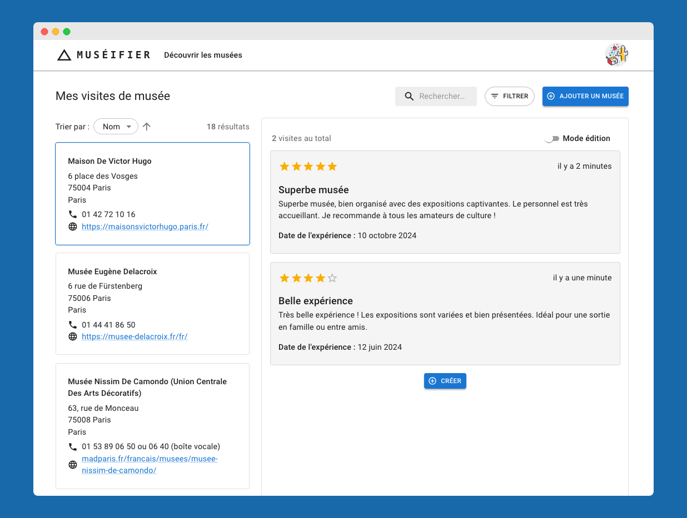
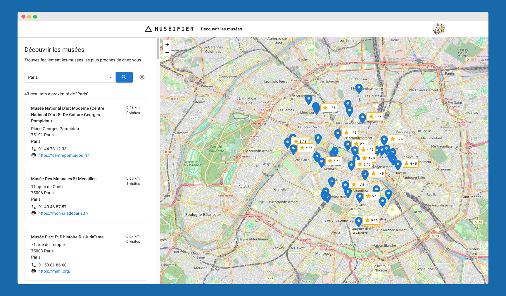

# Muséifier

Découvrir facilement les musées proches de chez vous et de noter vos visites. Explorer les musées locaux et gérer vos
visites, que vous soyez passionné d'art, d'histoire ou de sciences.

> ✅ Il est possible d'essayer l'application avec les identifiants suivants :
>
> email : `tartempion@demo.com` \
> mot de passe : `tartempion`

## Compétences acquises

- Développement d'une API RESTful (création des endpoints pour les fonctionnalités CRUD).
- Développement de l'interface utilisateur avec React et Material-UI.
- Création d'endpoints pour la recherche, le tri et le filtrage des musées.
- Mise en place de la pagination pour les listes de données volumineuses.
- Développement d'un module permettant de localiser les musées à proximité d'une adresse.
- Utilisation de l'API publique de adresse.data.gouv.fr pour le géocodage et l'autocomplétion des adresses.
- Implémentation de l'authentification OAuth 2.0 avec Keycloak en tant que serveur d'autorisation.
- Mise en place de tests d'intégration des contrôleurs avec l'objet MockMvc du Spring MVC Test framework.
- Déploiement de l'application sur un serveur de production avec Nginx.